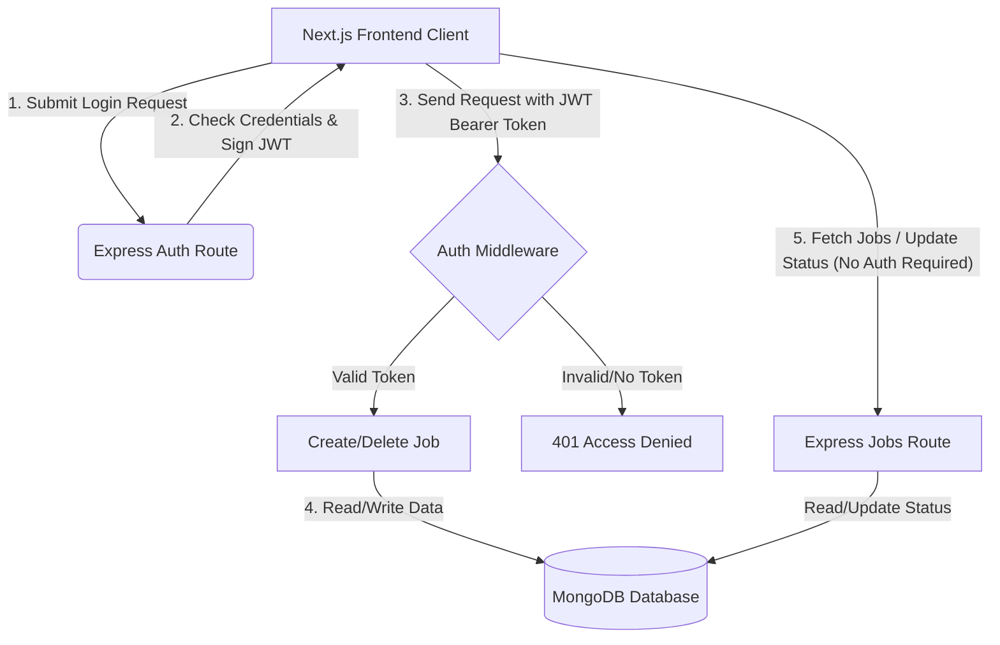

# 🛠️ Service Request Board

A full-stack web application designed for managing and tracking homeowner service requests (e.g., plumbing, electrical work, painting, joinery). Homeowners and technicians can create requests, search/filter items, and update request statuses via a modern, clean, and responsive dashboard.

This application is built with a decoupled architecture featuring an Express backend REST API linked to a MongoDB database, and a Next.js (App Router) frontend interface.

---

## 🚀 Tech Stack

### Frontend
*   **Framework:** [Next.js 16 (App Router)](file:///c:/Users/hafsa/Documents/GitHub/service-request-board/frontend)
*   **Library:** React 19 & TypeScript
*   **Styling:** Tailwind CSS v4
*   **HTTP Client:** Native `fetch` with state synchronization

### Backend
*   **Runtime:** Node.js
*   **Framework:** [Express.js 5](file:///c:/Users/hafsa/Documents/GitHub/service-request-board/backend)
*   **Database:** MongoDB via [Mongoose 9](file:///c:/Users/hafsa/Documents/GitHub/service-request-board/backend/models/JobRequest.js)
*   **Auth Middleware:** JWT (JSON Web Tokens) verification

---

## ✨ Features

### Core Functionality
*   **Browse Requests:** View all submitted service requests in real-time, ordered chronologically (newest first).
*   **Search & Filter:** Search jobs instantly by title or description, and filter by trade category.
*   **Detailed View:** Dynamically routes to detail pages for individual service requests.
*   **Create Requests:** Securely submit new service requests (requires admin login).
*   **Status Management:** Transition job progress seamlessly between status states: `Open` ➡️ `In Progress` ➡️ `Closed`.
*   **Delete Requests:** Securely remove service requests from the board (requires admin login).

### Premium UI & UX
*   **Status Badges:** Color-coded badges indicating current state.
*   **Skeleton Loading:** Clean loading states during data fetching.
*   **Responsive Layout:** Fully compatible across mobile, tablet, and desktop viewports.

---

## 📂 Project Structure

```text
service-request-board/
├── backend/                  # Express REST API
│   ├── middleware/
│   │   └── auth.js           # JWT Authorization Middleware
│   ├── models/
│   │   └── JobRequest.js     # Mongoose Schema (MongoDB Model)
│   ├── routes/
│   │   ├── authRoutes.js     # Authentication Routes (Login)
│   │   └── jobRoutes.js      # Job CRUD Routes
│   ├── server.js             # Main server entrypoint
│   ├── package.json
│   └── .env                  # Backend environment configs
│
└── frontend/                 # Next.js App Router Client
    ├── app/
    │   ├── globals.css       # CSS & Tailwind configuration
    │   ├── jobs/
    │   │   └── [id]/
    │   │       └── page.tsx  # Dynamic Individual Job View
    │   ├── login/
    │   │   └── page.tsx      # Admin Sign-In Screen
    │   ├── new/
    │   │   └── page.tsx      # Form to Create Service Requests
    │   ├── layout.tsx
    │   └── page.tsx          # Dashboard Board (Search, Filter, List)
    ├── package.json
    └── .env.local            # Frontend API config
```

---

## 🗄️ Database Schema (`JobRequest`)

The Mongoose model ([JobRequest.js](file:///c:/Users/hafsa/Documents/GitHub/service-request-board/backend/models/JobRequest.js)) expects the following fields:

| Field | Type | Required | Constraints / Validation |
| :--- | :--- | :---: | :--- |
| `title` | String | Yes | Trimmed |
| `description`| String | Yes | Trimmed |
| `category` | String | Yes | Must be: `"Plumbing"`, `"Electrical"`, `"Painting"`, `"Joinery"` |
| `location` | String | Yes | — |
| `contactName`| String | Yes | — |
| `contactEmail`| String | Yes | Must match standard email regex validation |
| `status` | String | Yes | Must be: `"Open"`, `"In Progress"`, `"Closed"` (Defaults to `"Open"`) |
| `createdAt` | Date | Auto | Generated by Mongoose `timestamps: true` |
| `updatedAt` | Date | Auto | Generated by Mongoose `timestamps: true` |

---

## ⚙️ Installation & Local Setup

To set up and run this application locally on your machine, follow these instructions.

### 1. Clone the Repository
Open your terminal and run:
```bash
git clone <your-repository-url>
cd service-request-board
```

### 2. Backend Setup 🔧
1. Navigate to the backend directory:
   ```bash
   cd backend
   ```
2. Install the backend dependencies:
   ```bash
   npm install
   ```
3. Create a `.env` file inside the `backend` folder and populate it with your database connection details and secret:
   ```env
   PORT=5000
   MONGO_URI=your_mongodb_connection_string
   JWT_SECRET=your_jwt_secret_key
   ADMIN_EMAIL=admin@globaltna.com
   ADMIN_PASSWORD=globaltnapass
   ```
4. Start the backend development server (runs with automatic reload via `nodemon`):
   ```bash
   npm run dev
   ```
   The backend server will run at: **`http://localhost:5000`**

---

### 3. Frontend Setup 💻
1. In a new terminal window, navigate to the frontend directory:
   ```bash
   cd ../frontend
   ```
2. Install the frontend dependencies:
   ```bash
   npm install
   ```
3. Create a `.env.local` file inside the `frontend` folder:
   ```env
   NEXT_PUBLIC_API_URL=http://localhost:5000/api
   ```
4. Run the frontend development server:
   ```bash
   npm run dev
   ```
   The frontend application will be served at: **`http://localhost:3000`**

---

## 🔗 API Endpoints

### Authentication Routes

#### 🔑 Generate JWT Token
*   **Method:** `POST`
*   **Endpoint:** `/api/auth/login`
*   **Body Payload:**
    ```json
    {
      "email": "admin@globaltna.com",
      "password": "globaltnapass"
    }
    ```
*   **Success Response (`200 OK`):**
    ```json
    {
      "token": "eyJhbGciOiJIUzI1NiIsIn...",
      "email": "admin@globaltna.com"
    }
    ```

---

### Job Requests Routes

| Method | Endpoint | Auth Required | Description |
| :--- | :--- | :---: | :--- |
| **GET** | `/api/jobs` | ❌ No | Get all jobs. Supports query filtering: `?category=Plumbing` or `?status=Open` |
| **GET** | `/api/jobs/:id` | ❌ No | Get full details for a single job request by ID |
| **POST** | `/api/jobs` |  Yes | Create a new job request |
| **PATCH** | `/api/jobs/:id` | ❌ No | Update status only (`Open`, `In Progress`, `Closed`) |
| **DELETE**| `/api/jobs/:id` |  Yes | Delete a job request |

> [!NOTE]
> **Authorized Requests:** For endpoints where Auth is required, you must include the token received from the `/login` route in your request headers:
> `Authorization: Bearer <your_jwt_token>`

---

## 🧪 Admin Credentials for Testing

Use these pre-configured credentials on the Login screen to authenticate and gain full access to **Creating** and **Deleting** requests:

*   **Email:** `admin@globaltna.com`
*   **Password:** `globaltnapass`

---

## 🧠 System Flow



---

## 👩‍💻 Author

**Hafsa**
*   Software Engineering Undergraduate
